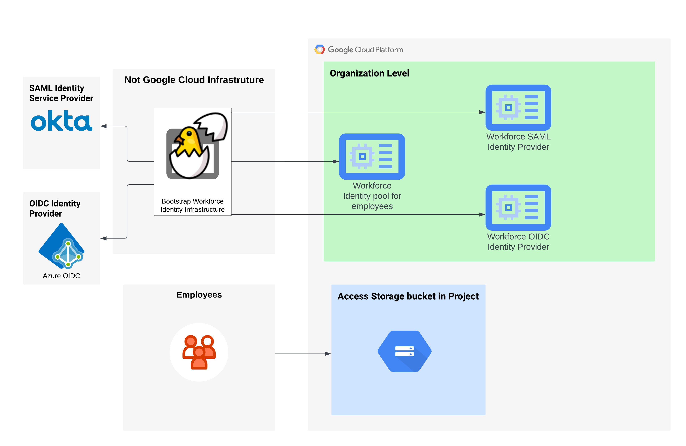

# Workforce-Identity-Federation

This is module is used to create workforce identity pool and corrresponding providers . It will help your employees to access GCP services outside from Google cloud without leverage your external identity provider.

## Demo Reference Architecture


## Prequisites

Following role is required
* `roles/iam.workforcePoolAdmin`

Required APIs & Services:

* `cloudresourcemanager.googleapis.com`
* `iam.googleapis.com`
* `iamcredentials.googleapis.com`
* `sts.googleapis.com`


## Sample 

```hcl
module "workforce-identity-federation" {
  source            = "jasonbisson/workforce-identity-federation/google"
  version = "~> 0.1"
}

```


## Requirements

| Name | Version |
|------|---------|
| <a name="requirement_terraform"></a> [terraform](#requirement\_terraform) | >= 0.13 |
| <a name="requirement_google"></a> [google](#requirement\_google) | >= 3.45, < 5.0.0 |

## Providers

| Name | Version |
|------|---------|
| <a name="provider_google-beta"></a> [google-beta](#provider\_google-beta) | n/a |

## Modules

| Name | Source | Version |
|------|--------|---------|
| <a name="module_member_roles"></a> [member\_roles](#module\_member\_roles) | terraform-google-modules/iam/google//modules/member_iam | n/a |

## Resources

| Name | Type |
|------|------|
| [google-beta_google_iam_workforce_pool.pool](https://registry.terraform.io/providers/hashicorp/google-beta/latest/docs/resources/google_iam_workforce_pool) | resource |
| [google-beta_google_iam_workforce_pool_provider.provider](https://registry.terraform.io/providers/hashicorp/google-beta/latest/docs/resources/google_iam_workforce_pool_provider) | resource |

## Inputs

| Name | Description | Type | Default | Required |
|------|-------------|------|---------|:--------:|
| <a name="input_description"></a> [description](#input\_description) | Description of the Pool | `string` | `null` | no |
| <a name="input_disabled"></a> [disabled](#input\_disabled) | Enable the Pool | `bool` | `false` | no |
| <a name="input_display_name"></a> [display\_name](#input\_display\_name) | Display name of the Pool | `string` | `null` | no |
| <a name="input_location"></a> [location](#input\_location) | Location of the Pool | `string` | n/a | yes |
| <a name="input_parent"></a> [parent](#input\_parent) | Parent id | `string` | n/a | yes |
| <a name="input_project_bindings"></a> [project\_bindings](#input\_project\_bindings) | Project bindings | <pre>list(object(<br>  {<br>    project_id = string<br>    roles = list(string)<br>    attribute = string<br>    all_identities = bool<br>   }<br>))</pre> | n/a | yes |
| <a name="input_session_duration"></a> [session\_duration](#input\_session\_duration) | Session Duration | `string` | `"3600s"` | no |
| <a name="input_wif_providers"></a> [wif\_providers](#input\_wif\_providers) | Provider config | `list(any)` | n/a | yes |
| <a name="input_workforce_pool_id"></a> [workforce\_pool\_id](#input\_workforce\_pool\_id) | Workforce Pool ID | `string` | n/a | yes |

## Outputs

| Name | Description |
|------|-------------|
| <a name="output_pool_id"></a> [pool\_id](#output\_pool\_id) | Pool id |
| <a name="output_pool_name"></a> [pool\_name](#output\_pool\_name) | Pool name |
| <a name="output_pool_state"></a> [pool\_state](#output\_pool\_state) | Pool state |
| <a name="output_provider_id"></a> [provider\_id](#output\_provider\_id) | Provider id |
